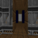
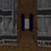

#  INTRINSIC CURIOSITY IN REINFORCEMENT LEARNING BY IMPROVING NEXT STATE PREDICTION
This repository contains the code for thesis defense submitted at https://vireo.library.uta.edu/submit/2007/file/8856/LOBO-THESIS-2020.pdf

### Introduction

In Reinforcement Learning, an agent receives feedback from the environment in the form of an extrinsic
reward. It learns to take actions that maximize this extrinsic reward. However, to start learning, the agent
needs to be able to get feedback from the environment by using random actions. This works in environments
with frequent rewards, however, in environments where the rewards are sparse the probability of reaching
any reward even once becomes very low. One way to explore an environment efficiently is for the agent to
generate its own intrinsic reward by using the prediction error from a model that is trained to predict the
next state based on the current state and action. This intrinsic reward is like the phenomena of curiosity and
leads the agents to revisit states where the prediction error is large. Since predicting the next state in pixel
space is not a trivial task, efforts have been made to reduce the complexity by using different ways to extract
a smaller feature space to make the prediction on. This thesis explores a couple of ways to stabilize the
training when using a Variational Autoencoder (VAE) to reduce the complexity of the next state prediction.
It looks at using a memory to train the VAE so that it does not overfit to a batch, it uses a recurrent layer to
improve the next state prediction and it integrates the concept of Learning Progress so that the agent does
not get stuck trying to predict something it cannot control.

Trained agents in the Sparse and Very Sparse settings of the Doom My Way Home Task.

 

### Setup

- Tensorflow 2
- Gym
- Numpy
- PIL
- imageio
- vizdoomgym 

### References

PPO code based on Stable Baselines repository:
https://github.com/hill-a/stable-baselines/blob/master/stable_baselines/common/distributions.py

VAE implementation based on:
https://medium.com/@wuga/generate-anime-character-with-variational-auto-encoder-81e3134d1439

Vizdoom Environment setup using: 
https://github.com/shakenes/vizdoomgym
